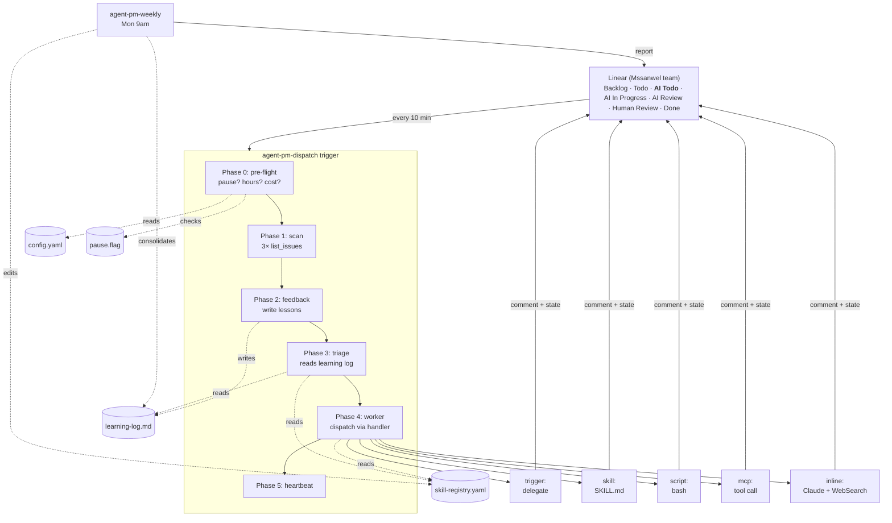

# Agent PM

> A Linear-native AI project manager. One dispatcher, many skills, a learning loop.

Drop an issue into an `AI Todo` column. Agent PM picks the right skill, executes it, posts the result back as a comment, and moves the issue on. When you correct it, it remembers. Weekly, it rewrites its own routing rules based on what you've taught it.

> **Read the [full user manual](docs/MANUAL.md)** for setup walkthroughs, daily use, debugging, and extending the system.

---

## The problem

You have a fleet of "AI workflows" that never quite add up to a team. A CRM-sync trigger here, a meeting-analysis skill there, an email-sync script somewhere else. Each one works. None of them know about each other. Every new workflow is another bespoke trigger.

The gap is a **dispatcher** — something that reads your Linear board, understands what an issue is asking for, and routes it to the right existing tool. This repo is that dispatcher.

## The shape



Three moving parts:

- **A registry** (`skill-registry.yaml`) — maps Linear labels + keywords to handlers.
- **A dispatcher** (`agent-pm-dispatch.md`) — a single scheduled trigger that runs every 10 minutes. Pre-flight → scan → feedback → triage → worker.
- **A learning loop** (`learning-log.md` + weekly trigger) — writes when you correct, reads during triage, auto-edits the registry weekly.

Linear is the UI *and* the message bus. Workflow states are a state machine. Comments are the conversation.

---

## Quickstart

```bash
git clone https://github.com/mssanwel/agent-pm ~/agent-pm
cd ~/agent-pm
```

### 1. Install the Linear MCP

In your Claude Code environment, ensure the `Linear` MCP server is configured. If you're running Claude Code locally:

```bash
claude mcp add linear --url https://mcp.linear.app/sse
```

(Check `claude mcp list` for verification.)

### 2. Create the `AI Todo` state in Linear

The Linear MCP can create labels but **not workflow states**. Do this once in the UI:

1. Settings → Teams → Your team → Workflow
2. In the **Unstarted** group (contains `Todo`), click **+ Add status**
3. Name: `AI Todo`
4. Position: directly after `Todo`
5. Save

Grab the new state's UUID (inspect via `mcp__linear__list_issue_statuses` or from the URL).

### 3. Create the labels

Either manually in the UI or — faster — use the MCP. You need:

- `agent-pm` (standalone label, teal `#00b8a9`)
- `Agent Skills` (label **group**)
- Under `Agent Skills`: `research`, `data-sync`, `report`, `meeting-prep`, `content`, `strategy`, `ops`, `knowledge`

### 4. Wire the registry

Edit `.claude/agent-pm/skill-registry.yaml`. Replace the placeholder UUIDs with yours:

```yaml
linear:
  team_id: <your-team-uuid>
  states:
    ai_todo: <uuid-you-just-created>
    ai_in_progress: <uuid>
    ai_review: <uuid>
    human_review: <uuid>
    done: <uuid>
  labels:
    agent_pm: <uuid>
    # ... etc
```

Then review each skill's `handler:` and point it at the real thing on your machine. Examples:

```yaml
meeting-analysis:
  handler: "skill:/path/to/your/meeting-analysis/SKILL.md"

crm-sync:
  handler: "trigger:crm-sync-analysis"      # name of your existing trigger

email-sync:
  handler: "script:/path/to/email-to-obsidian.sh"

obsidian-note:
  handler: "mcp:obsidian:create_or_update_note"

research:
  handler: "inline"     # Claude improvises with WebSearch + MCP
```

### 5. Install the launchd jobs (macOS, local execution)

Agent PM is designed to **run locally on your Mac** so it has access to local MCPs (Obsidian), local scripts, and local credentials. Cloud-hosted triggers don't see any of that.

```bash
cd ~/code/agent-pm
./scripts/install-launchd.sh
```

This copies two plists into `~/Library/LaunchAgents/` and loads them:

| Job label | When | What it runs |
|---|---|---|
| `com.mssanwel.agent-pm.dispatch` | Every 10 min | `scripts/run-dispatch.sh` → `claude -p` against the dispatch trigger |
| `com.mssanwel.agent-pm.weekly` | Mon 09:00 local | `scripts/run-weekly.sh` → Monday consolidation |

Each runner script:
- Checks `pause.flag` first and exits immediately if present
- Takes a lock at `.claude/agent-pm/dispatch.lock` to prevent overlapping runs (stale after 20 min)
- Logs to `.claude/agent-pm/logs/dispatch-YYYY-MM-DD.log`

**Why launchd and not cron?** macOS laptops miss cron jobs when asleep. launchd catches up on wake.

To uninstall: `./scripts/install-launchd.sh uninstall`.

### 6. Dry-run, then go live

The repo ships with `.claude/agent-pm/pause.flag` present — the dispatcher exits in pre-flight while it's there. That lets you register the cron, watch a tick fire harmlessly, and confirm the wiring.

When ready:

```bash
rm .claude/agent-pm/pause.flag
# or
/agent-pm resume
```

Now create a test issue:

- Title: `Research top 3 competitors in our space`
- Label: `agent-pm`
- State: `AI Todo`

Within 10 minutes, Agent PM adds the `research` label, posts a routing comment, moves to `AI In Progress`, executes, posts the result, and moves to `Human Review`.

---

## Handler types

The registry supports five ways to execute work. **Delegation, not duplication** — if a skill exists, reference it, don't rewrite.

| Handler | Format | When to use |
|---|---|---|
| `trigger:<name>` | `trigger:crm-sync-analysis` | A scheduled trigger already does this workflow. Dispatcher posts a "delegating" comment and leaves the issue for the other trigger to pick up. |
| `skill:<path>` | `skill:/Users/me/.claude/skills/email-sync/SKILL.md` | A `SKILL.md` file exists. Dispatcher reads it and follows its instructions with the issue context. |
| `script:<path>` | `script:/Users/me/scripts/sync.sh` | A working Python/TS/bash script does the work. Dispatcher invokes it with issue context as env vars (`LINEAR_ISSUE_ID`, `LINEAR_ISSUE_TITLE`, `LINEAR_ISSUE_DESCRIPTION`, `LINEAR_ISSUE_URL`). stdout → Linear comment. Non-zero exit → error path. |
| `mcp:<server>:<tool>` | `mcp:obsidian:create_or_update_note` | Direct MCP tool call. Dispatcher shapes the issue into the tool's input. |
| `inline` | `inline` | Fallback — Claude improvises with WebSearch, Read, and whatever MCP tools fit. Produces a structured result. |

---

## Default skills

Out of the box the registry ships with 12 skill routes. Rewire any of them to fit your stack.

| Skill | Labels | Handler | Needs approval? |
|---|---|---|---|
| `crm-sync` | data-sync | `trigger:crm-sync-analysis` | Yes |
| `meeting-analysis` | meeting-prep | `skill:…/meeting-analysis/SKILL.md` | No |
| `strategy-worksheet` | strategy | `skill:…/strategy-worksheet/SKILL.md` | No |
| `email-sync` | data-sync, knowledge | `skill:…/email-sync/SKILL.md` | No |
| `obsidian-note` | knowledge, content | `mcp:obsidian:create_or_update_note` | No |
| `graphify-ingest` | knowledge | `skill:…/graphify/SKILL.md` | No |
| `research` | research | `inline` | No |
| `financial-report` | report, ops | `inline` (upgrade to `script:` when ready) | Yes |
| `hiring-pipeline` | ops, report | `inline` (upgrade when wrapper exists) | Yes |
| `jira-sync` | data-sync, ops | `inline` | No |
| `content-draft` | content | `inline` | Yes |
| `general` | — | `inline` | No |

---

## The learning loop

This is the part that makes the system more than a router.

### How a correction becomes a lesson

Suppose you create an issue "Summarise the latest Kodifly board meeting." Agent PM routes it to `meeting-analysis` and posts a draft summary. You think the output was too shallow, so you comment:

> Too surface-level. Always pull the financial numbers and decisions, not just topics discussed.

Next dispatch tick (within 10 minutes):

1. **Phase 2 (Feedback)** picks up the comment because the issue's `updatedAt` is recent.
2. Appends to `.claude/agent-pm/learning-log.md`:
   ```markdown
   ## 2026-04-16

   ### MSS-182 — meeting-analysis
   - **Outcome**: corrected
   - **Correction**: Too surface-level. Always pull the financial numbers and decisions.
   - **Lesson**: Meeting analysis for Kodifly board meetings MUST include financial numbers and explicit decisions, not just topics.
   ```
3. Replies on the issue: `Noted — will pull financials + decisions on the next run. — Agent PM`

### How the lesson applies

On the next tick, when Phase 3 triages any new issue, it reads the **last 20 learning-log entries** before matching. That lesson is in the prompt. If a similar issue shows up, the agent factors the correction into its execution.

### How it becomes a rule

Monday 9am, the weekly trigger runs:

1. Reads the week's log.
2. Groups corrections by skill.
3. A theme recurring ≥2 times → an actual registry edit. Examples:
   - Human kept saying "don't post without asking first" → flip `requires_human_approval: true`
   - Human kept re-labelling issues → move the problematic keyword to the correct skill
4. Creates a Linear issue `Agent PM — week of …` with what changed and why.

The registry is the brain. It teaches itself.

---

## Configuration reference

`.claude/agent-pm/config.yaml` is the live control panel. Changes take effect on the next cron tick — no redeploy.

```yaml
timezone: Europe/London
working_hours:
  enabled: true
  start: "08:00"
  end: "19:00"
  days: [mon, tue, wed, thu, fri]
  process_feedback_outside_hours: false

frequency:
  dispatch_cron: "*/10 * * * *"
  weekly_cron: "0 9 * * 1"
  min_seconds_between:
    feedback: 0
    triage: 300
    worker: 600

limits:
  max_feedback_items: 2
  max_triage_items: 2
  max_worker_items: 1
  max_tokens_per_run: 100000

cost_caps:
  daily_usd_warn: 10
  daily_usd_stop: 25     # auto-pause at this figure

skill_overrides:
  crm-sync:
    working_hours: { enabled: false }     # runs 24/7

model:
  dispatch: claude-sonnet-4-6
  worker_default: claude-sonnet-4-6
  worker_complex: claude-opus-4-6
```

Anything under `skill_overrides.<name>` overrides the top-level value for that skill only.

---

## The `/agent-pm` slash command

Interactive control surface so you don't edit YAML by hand.

```
/agent-pm status             # pause state, hours, queues, today's cost, log tail
/agent-pm pause [reason]     # touch pause.flag with a reason
/agent-pm resume             # rm pause.flag
/agent-pm config             # print config.yaml with annotations
/agent-pm set <path> <val>   # e.g. `set working_hours.start 09:00`
/agent-pm skills             # list skills with handler + approval + usage
/agent-pm test <skill> "..."  # dry-run the router against a hypothetical title
/agent-pm log [n]            # tail last N learning-log entries
/agent-pm deploy             # re-register cron from config.yaml
/agent-pm doctor             # health check: MCP, paths, IDs, cron, perms
```

The slash command *is* a prompt file. No separate code to maintain.

---

## Safety model

Three layers of "this thing can't run amok":

1. **`pause.flag`** — a file that, when present, causes the dispatcher to exit in pre-flight *before any Linear calls*. Ships committed. Delete to go live.
2. **Working hours** — dispatcher exits cheaply outside the configured window. Feedback-only mode available via `process_feedback_outside_hours`.
3. **Daily cost cap** — dispatcher tallies spend from its own Heartbeat issue. When the hard cap is hit, it **writes the pause flag itself** and files a Linear issue in `Human Review`. It does not auto-resume; you clear it manually.

Additional per-run limits: `max_feedback_items`, `max_triage_items`, `max_worker_items`, `max_tokens_per_run` (aborts the current phase if exceeded).

---

## Cost model

| Phase | Est. tokens |
|---|---|
| Fast-exit (idle tick) | ~1.5K (3× `list_issues` + exit) |
| Feedback item | 3–5K |
| Triage item | 3–5K |
| Worker item | 10–50K (skill-dependent) |

| Scenario | Daily cost |
|---|---|
| All idle (144 ticks, no work) | ~$2.90 |
| Moderate (5–10 tasks/day) | ~$3–8 |

The daily cap in `cost_caps.daily_usd_stop` is a hard ceiling — auto-pause on breach.

---

## Repository layout

```
agent-pm/
├── .claude/
│   ├── agent-pm/
│   │   ├── README.md               # internal ops reference
│   │   ├── config.yaml             # runtime settings
│   │   ├── skill-registry.yaml     # routing table
│   │   ├── learning-log.md         # corrections + lessons
│   │   └── pause.flag              # kill switch (present = paused)
│   ├── triggers/
│   │   ├── agent-pm-dispatch.md    # every-10-min dispatcher
│   │   └── agent-pm-weekly.md      # Monday 9am consolidation
│   ├── commands/
│   │   └── agent-pm.md             # /agent-pm slash command
│   └── skills/                     # optional: skills moved into the repo
├── docs/
│   └── architecture.md             # deeper internals
├── README.md                       # you are here
├── CONTRIBUTING.md                 # how to add a skill or handler
├── LICENSE                         # MIT
└── .gitignore
```

---

## Troubleshooting

| Symptom | Likely cause | Fix |
|---|---|---|
| Dispatcher never runs | Cron not registered | `/agent-pm deploy` or `CronList` to confirm |
| "doctor" reports unresolved placeholders | `ai_todo` state not pasted into registry | Fetch the UUID and paste into `skill-registry.yaml:14` |
| Wrong skill picked | Keywords too loose | Tune `keywords:` for the intended skill, or drop a lesson into the log manually |
| Agent keeps asking for approval | `requires_human_approval: true` | Flip to `false` once trusted |
| Cost creeping | Busy day, or loop | Lower `limits.max_worker_items`, raise `min_seconds_between.worker` |
| No heartbeat comments | `pause.flag` present, or nothing in the queues | Check `/agent-pm status` |
| Bash can't reach Linear API | Deliberate — dispatcher uses MCP only | Don't use curl/Bash; always Linear MCP tools |

---

## Documentation

| Doc | Purpose |
|---|---|
| [`docs/MANUAL.md`](docs/MANUAL.md) | Full user manual — setup, daily use, debugging, extending |
| [`docs/architecture.md`](docs/architecture.md) | Internals — phase semantics, handler contract, cost model |
| [`.claude/agent-pm/README.md`](.claude/agent-pm/README.md) | Operator reference inside the runtime directory |
| [`CONTRIBUTING.md`](CONTRIBUTING.md) | How to add a skill |

---

## Contributing

See [CONTRIBUTING.md](CONTRIBUTING.md). In short:

1. Pick the handler type that fits
2. Add a block to `skill-registry.yaml`
3. If it's a new Linear label, create it
4. Dry-run with `/agent-pm test <skill> "sample title"`
5. Open a PR

---

## Design philosophy

**Linear is the UI.** Don't build a dashboard. The board already is one.

**The registry is a routing table, not a runtime.** Handlers own execution. The dispatcher only decides who gets the issue.

**Delegate, never duplicate.** If a skill exists anywhere, reference it. New code is the last option.

**The learning loop is write-during-feedback, read-during-triage.** A correction written on Monday must affect routing on Tuesday. If it doesn't, the loop is broken.

**Pause before you're sure.** `pause.flag` ships present. Cost cap writes it too. It costs nothing to restart.

---

## License

MIT. See [LICENSE](LICENSE).

## Credits

Scaffolded with [Claude Code](https://claude.com/claude-code). Made by [@mssanwel](https://github.com/mssanwel).
