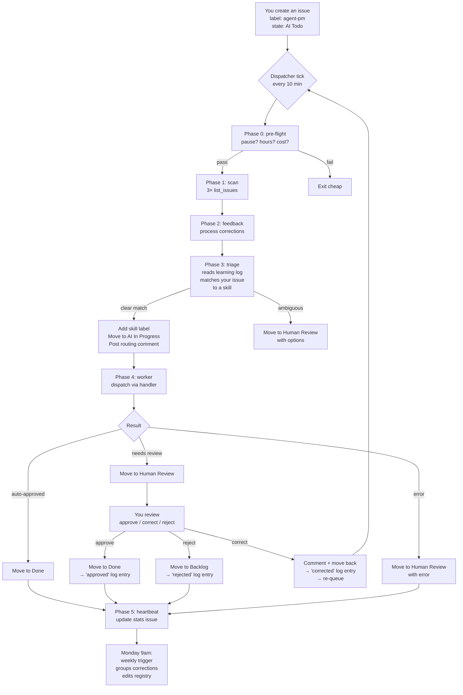

# Agent PM — User Manual

This is the operator's handbook. If the top-level `README.md` is the pitch, this is the full walkthrough — how to set it up, how to use it daily, how to extend it, and what to do when it misbehaves.

---

## Table of contents

1. [Mental model](#1-mental-model)
2. [Lifecycle of an issue](#2-lifecycle-of-an-issue)
3. [First-time setup](#3-first-time-setup)
4. [Daily use](#4-daily-use)
5. [Writing an issue that routes correctly](#5-writing-an-issue-that-routes-correctly)
6. [Reading a result comment](#6-reading-a-result-comment)
7. [Giving feedback (and what it does)](#7-giving-feedback-and-what-it-does)
8. [Handler types in depth](#8-handler-types-in-depth)
9. [Adding a new skill](#9-adding-a-new-skill)
10. [Changing behaviour without code](#10-changing-behaviour-without-code)
11. [Slash-command reference](#11-slash-command-reference)
12. [Debugging & troubleshooting](#12-debugging--troubleshooting)
13. [Safety features](#13-safety-features)
14. [Glossary](#14-glossary)

---

## 1. Mental model

There are three things to hold in your head.

**One dispatcher.** A scheduled trigger runs every 10 minutes. It's the only thing that talks to Linear on your behalf. Every decision flows through it.

**A routing table.** `skill-registry.yaml` maps Linear labels and keywords to *handlers*. Handlers are how work gets done — an existing trigger, a `SKILL.md` file, a script, an MCP call, or inline Claude improvisation.

**A learning log.** Every correction you make becomes an entry. The dispatcher reads recent entries before routing new work. Weekly, a second trigger consolidates entries into actual registry edits.

That's the whole system. Linear is the UI. Everything else is files.

---

## 2. Lifecycle of an issue



Workflow states map one-to-one onto the state machine:

| State | Type | Who moves things here |
|---|---|---|
| `Backlog` | backlog | You (for raw ideas) |
| `Todo` | unstarted | You — **agent never touches this** |
| `AI Todo` | unstarted | You, when you want the agent to pick it up |
| `AI In Progress` | started | The dispatcher, after triage |
| `AI Review` | started | Reserved for future second-pass verification |
| `Human Review` | started | The dispatcher, when your review is needed |
| `Done` | completed | Either (you close it, or the agent finishes a no-approval task) |

---

## 3. First-time setup

Do these in order. The whole thing should take under 20 minutes.

### 3.1 Clone the repo

```bash
git clone https://github.com/mssanwel/agent-pm ~/agent-pm
cd ~/agent-pm
```

### 3.2 Create the Linear workflow state

The Linear MCP can create labels but **not workflow states**. Do this once in the Linear web UI:

1. **Settings** → **Teams** → *your team* → **Workflow**
2. Find the **Unstarted** group (it contains `Todo`)
3. Click **+ Add status** next to it
4. Name: `AI Todo`
5. Description (optional): `Pickup queue for Agent PM — humans drop issues here`
6. Drag it so it sits **right after `Todo`**
7. Save

**Why this matters:** the whole point is that humans have a separate queue (`Todo`) the agent never touches. If you skip this and point `ai_todo` at `Todo`, the agent will start claiming your human work.

### 3.3 Create the labels

Either via Linear UI or (faster) via MCP. The set you need:

| Label | Group | Purpose |
|---|---|---|
| `agent-pm` | (standalone) | Marks issues for the dispatcher |
| `Agent Skills` | (label group) | Parent for all skill labels |
| `research` | Agent Skills | Deep research |
| `data-sync` | Agent Skills | CRM / email / Jira sync |
| `report` | Agent Skills | Reporting |
| `meeting-prep` | Agent Skills | Meeting analysis |
| `content` | Agent Skills | Draft writing |
| `strategy` | Agent Skills | Strategy work |
| `ops` | Agent Skills | Operations |
| `knowledge` | Agent Skills | Obsidian / Graphify writes |

### 3.4 Wire the registry

Open `.claude/agent-pm/skill-registry.yaml`. You'll see a `linear:` block at the top. Replace every UUID with the values from your workspace:

```yaml
linear:
  team_id: <your-team-uuid>
  states:
    ai_todo: <uuid-from-step-3.2>
    ai_in_progress: <uuid>
    ai_review: <uuid>
    human_review: <uuid>
    done: <uuid>
  labels:
    agent_pm: <uuid>
    research: <uuid>
    # ... etc
```

To fetch any UUID fast: use the Linear MCP `list_issue_statuses` or `list_issue_labels` tool against your team.

### 3.5 Point handlers at real assets

The registry ships with sensible defaults, but **you must edit the `handler:` paths** to point at things that exist on your machine.

Walk the list. For each skill, decide:

- **Already have a trigger?** → `handler: trigger:<name>`
- **Already have a `SKILL.md`?** → `handler: skill:<absolute-path>`
- **Already have a script?** → `handler: script:<absolute-path>`
- **MCP tool fits?** → `handler: mcp:<server>:<tool>`
- **None of the above?** → leave as `inline` for now

Run `/agent-pm doctor` afterwards — it checks every path and flags unresolved placeholders.

### 3.6 Register the cron

Two scheduled triggers:

| Trigger | Cron | File |
|---|---|---|
| `agent-pm-dispatch` | `*/10 * * * *` | `.claude/triggers/agent-pm-dispatch.md` |
| `agent-pm-weekly` | `0 9 * * 1` | `.claude/triggers/agent-pm-weekly.md` |

Register via the `CronCreate` tool, or run `/agent-pm deploy` once the slash command loads.

### 3.7 Dry-run

The repo ships with `.claude/agent-pm/pause.flag` present. While it's there, the dispatcher exits in pre-flight on every tick — no Linear calls, no LLM spend.

Trigger a manual dispatch run to confirm the wiring works end-to-end without side effects:

```
Run the agent-pm-dispatch trigger manually
```

You should see it exit immediately with a log line like `pause.flag present — exit`.

### 3.8 Go live

```bash
rm .claude/agent-pm/pause.flag
# or
/agent-pm resume
```

Create one test issue — title "Research top 3 competitors in our space", label `agent-pm`, state `AI Todo`. Within 10 minutes you'll see the agent route it, execute, and transition.

---

## 4. Daily use

You don't do anything. That's the point.

Throughout the week:

- **Drop issues in `AI Todo`.** Agent picks them up on the next tick.
- **Comment to correct.** Your comment becomes a lesson applied from the next tick.
- **Approve by moving to `Done`.** Good signal — gets logged as an approval.
- **Move back to `AI Todo`** to re-queue after a correction.

`/agent-pm status` once in the morning is usually enough to see where things stand.

---

## 5. Writing an issue that routes correctly

The triage phase uses three signals: **labels**, **keywords**, and **capability match**.

### Help the labels

If you already know which skill this is for, **add the Agent Skills child label yourself**. `research`, `meeting-prep`, `content`, etc. That's the strongest signal.

### Help the keywords

Include concrete domain words in the title or description. Examples:

| Good | Bad |
|---|---|
| "Research UK competitors for construction AI" | "Have a look at the market" |
| "Sync last week's Gmail deals into Attio" | "Update CRM" |
| "Draft a follow-up email to HKSTP after Friday's call" | "Reply to HKSTP" |

The registry has a `keywords:` list per skill. Use them if you want to be unambiguous.

### Be explicit about scope

One task per issue. If you ask for five unrelated things, the agent will pick one skill and do that one. It won't multi-head.

### When in doubt, describe the *output*

"Produce a one-page financial summary for Q1 2026" is clearer than "Do the finance thing." The agent will pattern-match on the output shape.

---

## 6. Reading a result comment

When the worker finishes, you get a comment that looks like this:

```
**What I did**: Pulled revenue and runway figures from Xero, compared to board targets.
**Outputs**:
- Q1 revenue: $X
- Runway: Y months
- Variance vs plan: Z%
**Confidence**: medium
**Caveats**: Xero Q1 not fully reconciled — two partner invoices pending.
— Agent PM
```

Everything signed `— Agent PM` is the agent. Anything else is a human (you or a collaborator). The dispatcher uses this signature to tell comments apart during feedback.

**Confidence** is a self-report. "High" means the agent is certain; "low" means double-check. **Caveats** are things the agent *knows* are incomplete.

---

## 7. Giving feedback (and what it does)

Three ways to give feedback. Each creates a different log entry.

### 7.1 Approve (→ `Done`)

Move the issue to `Done`. On the next tick, Phase 2 writes:

```markdown
### MSS-N — <skill>
- **Outcome**: approved
```

These reinforce which skills are working well. No other action.

### 7.2 Correct (comment, then move back to `AI Todo`)

Comment your correction first. Then move the issue back to `AI Todo`. On the next tick:

1. Phase 2 reads the comment, writes a `corrected` entry with your text and a one-line lesson.
2. Phase 3 re-triages the issue. The new learning-log entry is in context.
3. Phase 4 re-executes — informed by the lesson.

### 7.3 Reject (move to `Backlog`)

Move the issue to `Backlog`. Phase 2 writes a `rejected` entry. The issue is out of the agent's scope now.

### The weekly registry rewrite

On Monday 9am, if a theme from `corrected` entries shows up **≥2 times**, the weekly trigger edits the registry. Example: if you kept saying "don't post this email without asking" on `content-draft` outputs, `requires_human_approval` flips to `true` automatically.

A Linear issue `Agent PM — week of <date>` summarises what changed.

---

## 8. Handler types in depth

### `trigger:<name>`

Used when an existing scheduled trigger owns this workflow. The dispatcher:

1. Posts a comment: `Delegating to trigger <name>. — Agent PM`
2. Leaves the issue in `AI In Progress`
3. Does NOT run the trigger — that trigger runs on its own cron

**Use case:** CRM sync with its own dedicated analysis + write triggers.

### `skill:<path>`

Dispatcher reads `SKILL.md` at `<path>` (absolute path, tilde-expanded), then follows its instructions using the issue as context. Result posted as a comment.

**Use case:** Complex multi-step workflows that already have a documented skill (email-sync, meeting-analysis).

### `script:<path>`

Dispatcher invokes the script with these env vars:

- `LINEAR_ISSUE_ID` — e.g. `MSS-123`
- `LINEAR_ISSUE_TITLE`
- `LINEAR_ISSUE_DESCRIPTION`
- `LINEAR_ISSUE_URL`

stdout becomes the Linear comment body. Non-zero exit moves the issue to `Human Review` with stderr.

**Use case:** Existing Python/TS/bash scripts you don't want to rewrite as a SKILL.md.

### `mcp:<server>:<tool>`

Direct MCP tool call. Dispatcher shapes the issue description into the tool's input JSON and invokes it.

**Use case:** One-shot operations like "create an Obsidian note" or "ingest into Graphify."

### `inline`

Claude improvises — WebSearch, Read, MCP tools, whatever fits. Structured result at the end.

**Use case:** Fallback. Research tasks. Anything that doesn't have a dedicated skill yet.

---

## 9. Adding a new skill

Four steps:

### 9.1 Pick the handler type

See section 8. Default to `inline` if there's no existing asset — you can upgrade later.

### 9.2 Add a registry entry

Edit `.claude/agent-pm/skill-registry.yaml`:

```yaml
my-new-skill:
  labels: [my-label]
  keywords: [keyword, synonym]
  handler: skill:/absolute/path/SKILL.md
  capability: "One-sentence description of what this does"
  requires_human_approval: false
```

### 9.3 Create the Linear label if new

If `my-label` doesn't exist, create it via `mcp__linear__create_issue_label` (put it under the `Agent Skills` parent group). Add the UUID to the `labels:` section of the registry header.

### 9.4 Dry-run

```
/agent-pm test my-new-skill "An example title that should match"
```

The slash command reports which skill would win. Tune keywords until yours does.

---

## 10. Changing behaviour without code

Most tuning happens in `.claude/agent-pm/config.yaml`. Change values, wait for the next tick — no redeploy.

### Common tweaks

| Want to… | Change |
|---|---|
| Only run during business hours | `working_hours.start` / `end` / `days` |
| Let feedback run 24/7 | `working_hours.process_feedback_outside_hours: true` |
| Cap daily spend | `cost_caps.daily_usd_stop` |
| Handle more per tick | `limits.max_worker_items` (bump to 2 or 3) |
| Slow down ticks | Change `frequency.dispatch_cron` (then `/agent-pm deploy`) |
| Override for one skill | `skill_overrides.<name>.<key>` |

### Per-skill overrides

```yaml
skill_overrides:
  crm-sync:
    working_hours: { enabled: false }     # CRM runs 24/7
  financial-report:
    working_hours: { days: [mon] }        # finance only on Mondays
```

Any top-level key (`working_hours`, `model`, `limits`) can be overridden per skill.

---

## 11. Slash-command reference

```
/agent-pm                         # help
/agent-pm status                  # snapshot: pause, hours, queues, cost, last log
/agent-pm pause [reason]          # touch pause.flag with optional reason
/agent-pm resume                  # remove pause.flag
/agent-pm config                  # print config with annotations
/agent-pm set <path> <value>      # set config value; shows diff + confirm
/agent-pm skills                  # list skills with handler, approval, usage
/agent-pm test <skill> "<title>"  # dry-run router, no Linear writes
/agent-pm log [n]                 # tail last N learning-log entries
/agent-pm deploy                  # re-register cron from config
/agent-pm doctor                  # full health check: MCP, paths, IDs, cron
```

Examples:

```
/agent-pm set working_hours.start 09:00
/agent-pm set cost_caps.daily_usd_stop 50
/agent-pm set skill_overrides.crm-sync.working_hours.enabled false
/agent-pm test research "Investigate acme.io positioning"
```

---

## 12. Debugging & troubleshooting

### Nothing is happening

Check in order:

1. `/agent-pm status` — `PAUSED`? → `/agent-pm resume`
2. Outside working hours? → normal, wait or adjust config
3. Cron registered? → `CronList` or `/agent-pm deploy`
4. Is there anything *to* do? → the fast-exit path is silent by design

### Wrong skill picked

1. Check the routing comment — which skill won and why?
2. Tune `keywords:` in the registry for the skill that *should* have won
3. Or add a `corrected` entry to the log by commenting the correction on the issue

### Dispatcher crashes

Look for a Linear issue titled `Agent PM — dispatch error <timestamp>` in `Human Review`. The body contains the error and a stack. Common causes:

- MCP server unavailable → transient, wait one tick
- Registry YAML invalid → fix the file
- Referenced skill path doesn't exist → `/agent-pm doctor` to catch

### Cost spiralling

Immediate: `/agent-pm pause "cost spike"`. Investigate via heartbeat comments. Then:

- Lower `limits.max_worker_items` to 1
- Raise `frequency.min_seconds_between.worker`
- Consider whether a skill is looping — check if the same issue reappears in `Q_work` every tick

### `/agent-pm doctor` reports unresolved placeholders

One of the UUIDs in `skill-registry.yaml` is still a placeholder (e.g. `TODO-create-AI-Todo-state-in-Linear-UI`). Fetch the real ID and paste it in.

---

## 13. Safety features

| Feature | Where | What it does |
|---|---|---|
| `pause.flag` | `.claude/agent-pm/pause.flag` | Dispatcher exits before any Linear call if present |
| Working hours | `config.yaml` | Dispatcher exits cheap outside the window |
| Cost cap | `config.yaml` | Auto-creates `pause.flag` + Linear issue when daily spend hits the hard cap |
| Token watchdog | `config.yaml` | Aborts current phase if `max_tokens_per_run` exceeded |
| Sign rule | Every comment | `— Agent PM` on all outputs; feedback phase uses it to avoid replying to itself |
| Human-approval flag | per skill | `requires_human_approval: true` forces `Human Review` instead of `Done` |
| Label guard | dispatcher | Only processes issues with the `agent-pm` label |
| State guard | dispatcher | Never touches `Todo` or any state outside the registry config |

Any one of these is enough to stop the system safely.

---

## 14. Glossary

| Term | Definition |
|---|---|
| **Dispatcher** | The every-10-minute trigger (`agent-pm-dispatch.md`) |
| **Weekly** | The Monday 9am trigger (`agent-pm-weekly.md`) |
| **Registry** | `skill-registry.yaml` — the routing table |
| **Handler** | How a skill executes (`trigger:`, `skill:`, `script:`, `mcp:`, `inline`) |
| **Skill** | A registry entry, not the underlying asset |
| **Triage** | Phase 3 — matching issue → skill |
| **Worker** | Phase 4 — executing the handler |
| **Feedback** | Phase 2 — writing lessons from your corrections |
| **Heartbeat** | The pinned Linear issue the dispatcher logs to after non-idle ticks |
| **Learning log** | `learning-log.md` — rolling record of corrections and approvals |
| **Skill override** | Per-skill config values that replace the top-level defaults |

---

For architecture internals, see [`docs/architecture.md`](./architecture.md).
For contribution process, see [`../CONTRIBUTING.md`](../CONTRIBUTING.md).
